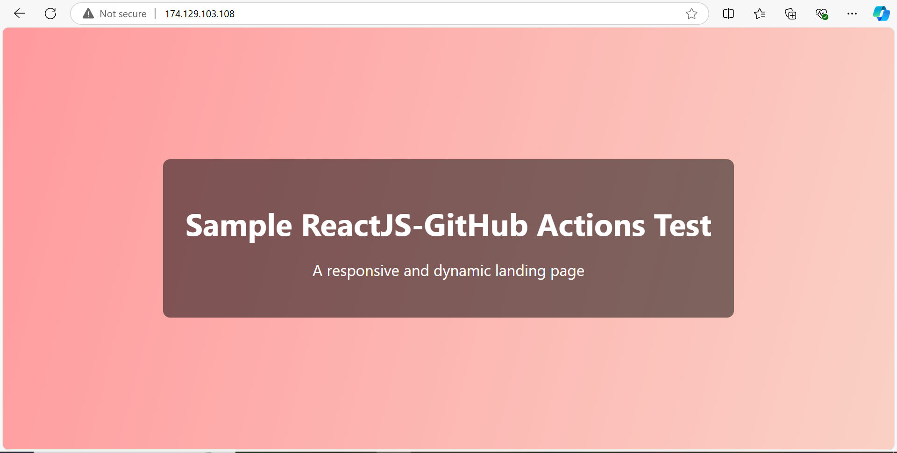

# React App with GitHub Actions CI/CD Pipeline

## Overview

This project is a React application with a fully integrated CI/CD pipeline using GitHub Actions, JFrog Artifactory, and Nginx for deployment. The pipeline automates testing, building, and deploying the React app to a remote server, ensuring a streamlined development and deployment process.

## Application Screenshot



*Caption: Screenshot of the React application running in a web browser.*

## Table of Contents

1. [Project Structure](#project-structure)
2. [Prerequisites](#prerequisites)
3. [Getting Started](#getting-started)
4. [Development Workflow](#development-workflow)
5. [CI/CD Pipeline](#cicd-pipeline)
   - [CI Pipeline](#ci-pipeline-ciyml)
   - [CD Pipeline](#cd-pipeline-cdyml)
6. [Configuration](#configuration)
7. [Troubleshooting](#troubleshooting)
8. [Contributing](#contributing)
9. [License](#license)

## Project Structure

```
.
├── .github/
│   └── workflows/
│       ├── ci.yml          # Continuous Integration pipeline
│       └── cd.yml          # Continuous Deployment pipeline
├── node_modules/           # Project dependencies (git-ignored)
├── public/                 # Static assets for the application
│   ├── index.html          # Main HTML file
│   ├── favicon.ico         # Favicon
│   └── manifest.json       # Web app manifest
├── src/                    # Source code of the React application
│   ├── components/         # React components
│   ├── styles/             # CSS or SCSS files
│   ├── utils/              # Utility functions
│   ├── App.js              # Main App component
│   └── index.js            # Entry point of the app
├── .gitignore              # Files and directories to ignore in Git
├── package.json            # Project metadata and dependencies
├── pnpm-lock.yaml          # Lock file for pnpm (package manager)
└── README.md               # Project documentation (this file)
```

## Prerequisites

Ensure you have the following set up before using the pipeline:

- **Node.js** (v18 or higher)
- **pnpm** (preferred package manager)
- **Git** (for version control)
- **GitHub account** and repository to host the code
- **JFrog Artifactory** account and repository
- **Remote server** with Nginx installed for deployment

## Getting Started

1. Clone the repository:
   ```bash
   git clone https://github.com/your-username/your-repo.git
   cd your-repo
   ```

2. Install dependencies:
   ```bash
   pnpm install
   ```

3. Set up environment variables:
   Create a `.env` file in the root directory and add necessary environment variables:
   ```
   REACT_APP_API_URL=https://api.example.com
   ```

4. Run the development server:
   ```bash
   pnpm start
   ```

5. Open `http://localhost:3000` in your browser to view the app.

## Development Workflow

1. Create a new branch for your feature or bug fix:
   ```bash
   git checkout -b feature/your-feature-name
   ```

2. Make changes to the code and commit them:
   ```bash
   git add .
   git commit -m "Add your commit message here"
   ```

3. Push your branch to GitHub:
   ```bash
   git push origin feature/your-feature-name
   ```

4. Create a Pull Request on GitHub for review.

5. Once approved and merged, the CI/CD pipeline will automatically deploy the changes.

## CI/CD Pipeline

### CI Pipeline (`ci.yml`)

The CI pipeline is triggered on every push to the `main` branch and for all pull requests. It performs the following steps:

1. **Checkout**: Clones the repository
2. **Setup Node.js**: Installs Node.js and pnpm
3. **Install Dependencies**: Runs `pnpm install`
4. **Lint**: Checks code style using ESLint
5. **Test**: Runs unit and integration tests
6. **Build**: Creates a production build of the app
7. **Upload Artifact**: Uploads the build to JFrog Artifactory

### CD Pipeline (`cd.yml`)

The CD pipeline is triggered after a successful CI run on the `main` branch. It performs these steps:

1. **SSH Connection**: Establishes an SSH connection to the remote server
2. **Download Artifact**: Downloads the latest build artifact from JFrog Artifactory to the server
3. **Unzip**: Extracts the contents of the downloaded artifact
4. **Restart Nginx**: Restarts the Nginx server to serve the new version of the application

This automated process ensures that the latest version of your application is deployed efficiently and consistently.

## Configuration

### GitHub Secrets

Set up the following secrets in your GitHub repository:

- `JFROG_URL`: The URL of your JFrog Artifactory instance
- `JFROG_USERNAME`: Your JFrog Artifactory username
- `JFROG_PASSWORD`: Your JFrog Artifactory password or API token
- `SSH_PRIVATE_KEY`: The private SSH key for connecting to the remote server
- `SERVER_USERNAME`: The username for the remote server (e.g., `ubuntu`)
- `SERVER_IP`: The IP address of the remote server

### JFrog Artifactory

1. Create a repository in JFrog Artifactory to store your build artifacts.
2. Update the `ci.yml` file with the correct repository name and path.

### Nginx Configuration

Ensure your Nginx configuration on the remote server is set up to serve your React app. A basic configuration might look like this:

```nginx
server {
    listen 80;
    server_name your-domain.com;
    root /path/to/your/react/app;
    index index.html;
    
    location / {
        try_files $uri $uri/ /index.html;
    }
}
```

## Troubleshooting

- **CI Pipeline Fails**: Check the GitHub Actions logs for detailed error messages. Common issues include failing tests or linting errors.
- **CD Pipeline Fails**: 
  - Verify that all required secrets are correctly set in GitHub.
  - Ensure the SSH key has the necessary permissions on the remote server.
  - Check if JFrog Artifactory is accessible and the artifact exists.
  - Verify that the server has enough disk space to download and unzip the artifact.
  - Check server logs for any issues during the Nginx restart process.
- **App Not Updating**: 
  - Ensure that Nginx is configured correctly to serve the new files.
  - Check file permissions on the server to make sure Nginx can access the new files.
  - Verify that the unzip process completed successfully.

## Contributing

1. Fork the repository
2. Create your feature branch (`git checkout -b feature/AmazingFeature`)
3. Commit your changes (`git commit -m 'Add some AmazingFeature'`)
4. Push to the branch (`git push origin feature/AmazingFeature`)
5. Open a Pull Request
